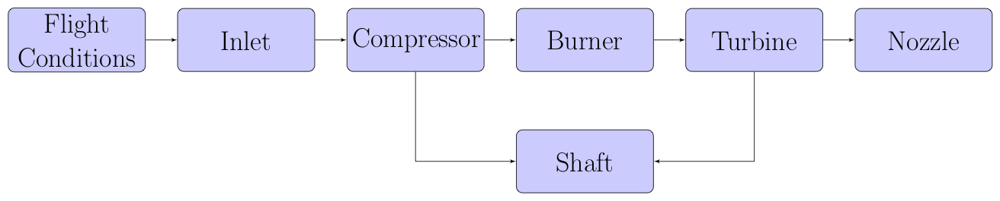

--------
TurboJet
--------

The performance of all jet engines can be modeled by setting up an appropriate model of the thermodynamic cycle that a particular engine is based on. 
One of the simplest kinds of jet engines is the single spool turbojet engine. 
The first ever production turbojet engine, the Junkers Jumo 004, was a single spool turbojet that was used to power the ME-262 jet fighter at the end of world war 2. 
By "single spool", we mean that there is a one spinning shaft that connects a single compressor to a single turbine. 

The relative simplicity that is an inherent feature of the single spool turbojet makes it a good place to start learning how to model the performance of jet engines. 

Terminology
------------

Element
*******
Every pyCycle model is built up from set of OpenMDAO groups that we call **Elements**. 
This is our term for "something that performs a thermodynamic operation". 
Examples of elements include: :code:`Inlet`, :code:`Compressor`, :code:`Nozzle`. 
Each box in the above flow diagram for a turbojet represents one Element. 
pyCycle ships with a :ref:`library of pre-built elements<element_ref>` for you to use, 
but you could also write your own as needed. 

Cycle 
*****
Elements are assembled within a containing OpenMDAO group, called the **Cycle**. 
The cycle is represented by the entire flow diagram above. 
Notice that there are some loops in that diagram, indicating that a nonlinear solver is needed. 
These data cycles create implicit relationships between the elements in the model, and they show up in nearly every kind of thermodynamic cycle model.  
pyCycle uses OpenMDAO's NewtonSolver and a DirectSolver to converge these implicit cycles. 

"on-design" vs. "off-design"
****************************
We're going to walk you through a run script that builds a single spool turbojet model and runs it in both **on-design** and **off-design** modes. 
All pyCycle models will be run in both modes, and it is important to understand what each one is for and how the relate to each other. 

The **on-design** mode (i.e. :code:`design=True`) takes a given mass-flow rate (pyCycle uses the variable :code:`W` to represent mass-flow) and computes the various flow-areas and performance map-scalars for all of elements in the cycle. 
These calculations only need to be run one time, and you should only ever have one instance of the cycle running in on-design mode. 
There is an associated flight-condition with the on-design calculations, which you choose because it provides a convenient place to specify the mass-flow. 
For example, subsonic cycles usually use either sea-level-static or top-of-climb as their on-design condition. 

The **off-design** mode (i.e. :code:`design=False`) requires the areas and map-scalars as inputs, and then computes the mass-flow rate and overall performance of the cycle for any given flight condition. 
You will use off-design mode to get performance data about your engine cycle for any operating condition you care about. 

Preamble 
--------
Import statements

Creating the turbojet model
---------------------------
 
    Adding cycle elements
    
    Setting thermodynamic properties

    Connecting flow stations

    Connecting cycle elements
    
    Setting up balances

    Setting execution order

    Add/setup Newton solver

Configuring output viewer
--------------------------

Executing the model
-------------------

Example results (page viewer)
-----------------------------